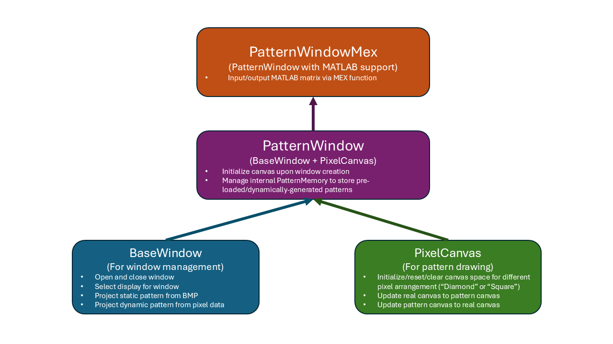

# DMD-SDL
Binary pattern streaming app developed with SDL3 to stream patterns displayed on a Digital micromirror device (DMD, LightCrafter4500EVM from Texas Instrument) to realize real-time optical tweezer generation.

The binary patterns are packed to 24-bit RGB and sent to DMD via the parallel RGB interface, with DMD set to pattern sequence mode to stream pattern sequence from a video source.

## Setup
To use, download the source code or clone the repo with the following command:
```bash
git clone https://github.com/ChinLabQMS/DMD-SDL.git
```
To compile the source code into executables, a compiler is required. To check if MinGW is installed on your system, run the following command:
```bash
gcc --version
```
If MinGW is not installed, download and install MinGW before proceeding.

## Dependencies

### SDL3 (version 3.2.4)
We are using [SDL3](https://www.libsdl.org/) to utilize the high DPI windows support functionality.

#### Compiling SDL3
SDL3 is pre-complied to a static library stored in [lib/libSDL3.a](lib/libSDL3.a) for windows system.
In most cases, you shouldn't have to compile SDL3 from source code, but if you want, you can follow the instructions below:

0. Make sure you have build tools that includes C++ compiler installed on your system. MinGW is recommended for Windows users.
1. Download the SDL3 source code from the SDL3 repository. The example here is for `SDL3-3.2.4` version. Newer versions of SDL3 may be available in the future with bug fixes and new features.
2. Download and install [CMake](https://cmake.org/). The default installation settings should expose the `cmake` command to the terminal.
3. Open a terminal and navigate to the SDL3 source code directory. Create a new directory (e.g. `SDL3_build`) to store the built libraries.
4. Run the following command to generate the built static libraries, note that the path to the source code and the build directory may vary depending on your setup:
```bash
cmake -S ./SDL3-3.2.4 -B ./SDL3_build -G "MinGW Makefiles" -DCMAKE_BUILD_TYPE=Release -DSDL_SHARED=OFF -DSDL_STATIC=ON
```
5. Navigate to the `SDL3_build` directory, it should now contains a `Makefile` that can be used with MinGW `mingw32-make` tool. Run the following command to build the SDL3 libraries:
```bash
mingw32-make
```
6. The libraries should be built in the `SDL3_build/` directory. Default name should be `libSDL3.a`. You can copy this libraray file to the `DMD-SDL/lib` directory.
7. Copy all the header files from the source directory include folder `SDL3-3.2.4\include\SDL3` to the `DMD-SDL/include` directory.

## Structure
The main components are: `BaseWindow`, `PatternWindow`, and `PixelCanvas`.


If only require the basic window functionalities, use `BaseWindow` class. 
If using the C++ code for generating patterns, use `PixelCanvas` class.
If require pixel pattern drawing with window functionality, use `PatternWindow` class. 
If require MATLAB interface, use `PatternWindowMex` class.

## Static pattern projection
`static.cpp` Create an opaque window with target size, and open a file selection dialog to select a BMP file, then render a static pattern loaded from BMP to the window.

To build an executable for `static.cpp`, run the following command in the project root directory:
```bash
mingw32-make static
```
It will build two executables: `static.exe` and `static_debug.exe` in the `bin` directory.
The `static_debug.exe` is built with a different default window size and is used for debugging purposes (e.g. to see the pattern on an actual monitor instead of DMD).

## Test pattern refresh rate
`black_white.cpp` Create an opaque window with target size, and render a black and white pattern to the window. The pattern will switch between black and white at the rate specified by VSNYC signal. Most of the time SDL3 will use the primary monitor's refresh rate for VSYNC, so it is recommended to set DMD as the primary monitor to test the refresh rate.

## Interface to MATLAB
`PatternWindowMex.cpp` is a MATLAB interface to the pattern window. 
It allows MATLAB to create and close a window and modify the window state.
In addition to window open/close and window content manipulation, the Mex function also integrates support for dynamically drawing patterns with [PixelCanvas](/include/PixelCanvas.h) class.

To use a version of MinGW that is supported by MATLAB, install this addon: [MATLAB Support for MinGW-w64 C/C++/Fortran Compiler](https://www.mathworks.com/matlabcentral/fileexchange/52848-matlab-support-for-mingw-w64-c-c-fortran-compiler).

To build the mex file, run the following command under the project root directory in MATLAB command window:
```bash
mex src/PatternWindowMex.cpp src/PatternWindow.cpp src/PixelCanvas.cpp src/BaseWindow.cpp -R2018a -output mex/PatternWindowMex CXXFLAGS="$CXXFLAGS -O3 -fopenmp -std=c++17" LDFLAGS="$LDFLAGS -fopenmp" -DTEST=0 -Iinclude -Llib -lSDL3 -lkernel32 -luser32 -lgdi32 -lwinmm -limm32 -lole32 -loleaut32 -lversion -luuid -ladvapi32 -lsetupapi -lshell32 -ldinput8
```
If the compliation is successful, a `PatternWindowMex.mexw64` file will be created in the project root directory.
To test, run the following command in MATLAB command window:
```bash
PatternWindowMex
```
A black window should appear. To close the window, run the command again.

Alternatively, you can use the [compile_mex.m](/mex/compile_mex.m) MATLAB script for compilation, 
or the pre-built `PatternWindowMex.mexw64` file for windows system under [mex](/mex) folder.

#### Available functions in C++ Mex file

**Basic window/Mex file state control**
- `PatternWindowMex()` - toggle window state (open/close)
- `PatternWindowMex("open", pixel_arrangement="Diamond", verbose=true, use_parallel=true)` - open the window with specified pixel arrangement ("Diamond" or "Square") and parallel processing (true/false)
- `PatternWindowMex("close", verbose=true)` - close the window
- `PatternWindowMex("lock")` - lock the Mex file such that it won't be cleared with `clear mex` command
- `PatternWindowMex("unlock")` - unlock the Mex file to allow it to be cleared with `clear mex` command

**Query value of properties**
- `PatternWindowMex("getLockState")` - get the lock state of the Mex file 
- `PatternWindowMex("getMexName")` - get the name of the Mex file
- `PatternWindowMex("getBaseDirectory")` - get the working directory of the Mex file
- `PatternWindowMex("isWindowCreated")` - check if the window is open
- `PatternWindowMex("isWindowMinimized")` - check if the window is minimized
- `PatternWindowMex("getDisplayModes")` - get the display modes of all the monitors connected to the system as a struct array
- `PatternWindowMex("getDisplayIndex")` - get the target display index of the window, window may not be created
- `PatternWindowMex("getWindowHeight")` - get the height of the window if it is open, otherwise return 0
- `PatternWindowMex("getWindowWidth")` - get the width of the window if it is open, otherwise return 0
- `PatternWindowMex("getOperationMode")` - get the mode of the window (static/dynamic/color)
- `PatternWindowMex("getStaticPatternPath")` - get the path of the static pattern loaded to the window if it is in static mode (empty if not in static mode)
- `PatternWindowMex("getStaticPattern")` - get the static pattern loaded to the window
- `PatternWindowMex("getStaticPatternRGB")` - get the static pattern in RGB format
- `PatternWindowMex("getStaticPatternReal")` - get the static pattern in real-space format
- `PatternWindowMex("getStaticPatternRealRGB")` - get the static pattern in real-space RGB format
- `PatternWindowMex("getPatternCanvas")` - get the pattern canvas of the window, which should be in sync with window content in static mode
- `PatternWindowMex("getPatternCanvasRGB")` - get the pattern canvas of the window in RGB format, which should be in sync with window content in static mode
- `PatternWindowMex("getRealCanvas")` - get the real-space canvas of the window, which should be in sync with window content in static mode
- `PatternWindowMex("getRealCanvasRGB")` - get the real-space pattern canvas of the window in RGB format, which should be in sync with window content in static mode
- `PatternWindowMex("getNumLoadedPatterns")` - get the number of patterns loaded to the pattern memory
- `PatternWindowMex("getPatternMemory", index)` - get the pattern memory at the specified index, index is an integer
- `PatternWindowMex("getPatternMemoryRGB", index, use_parallel=true)` - get the pattern memory at the specified index in RGB format, index is an integer

**Pattern window configuration**
- `PatternWindowMex("setDisplayIndex", display_index, verbose=true)` - set the display index (0-index integer) of the window to the specified display, the order is the same as the one returned by `PatternWindowMex("getDisplayModes")`
- `PatternWindowMex("displayColor", color=[0,0,0], verbose=true)` - display a color on the window, color is a 1x3 vector with RGB values
- `PatternWindowMex("setStaticPatternPath", path, verbose=true, use_parallel=true)` - set the static pattern to be displayed on the window, path is the path to the BMP file
- `PatternWindowMex("selectAndProject", verbose=true)` - open a file selection dialog to select a BMP file and project it to the window as a static pattern
- `PatternWindowMex("selectAndLoadPatternMemory", verbose=true, use_parallel=true)` - open a file selection dialog to select one/more BMP file and load it to the pattern memory
- `PatternWindowMex("displayPatternMemory", index, delay=0, verbose=true, use_parallel=true)` - display the pattern memory at the specified index, index is an integer starting from 0, and delay is the wait time in milliseconds after displaying the pattern

**Utility**
- `PatternWindowMex("convertPattern2RGB", pattern, use_parallel=true)` - convert the pattern to RGB format with parallel processing (true/false), pattern is an array of uint32 values, return the RGB pattern as a 3D array of uint8 values
- `PatternWindowMex("convertRGB2Pattern", rgb_pattern, use_parallel=true)` - convert the RGB pattern to pattern with parallel processing (true/false), rgb_pattern is a 3D array of uint8 values, return the pattern as an array of uint32 values
